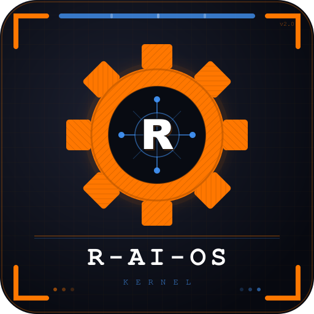

# R-AI-OS Kernel

<p align="center">
  
</p>

<p align="center">
<pre>
  ╔═╗ ══════════════════════════════════════════ ╔═╗
  ║ ╚╗                                          ╔╝ ║
  ╚═╗║         ▄█████████████▄                  ║╔═╝
    ║║      ▄█▀  ┌─────────┐  ▀█▄               ║║
    ║║   ▄█▀  ───│   · │ · │───  ▀█▄            ║║
    ║║   █ ─────│   │ R │  │ ───── █           ║║
    ║║   ▀█▄  ───│   · │ · │───  ▄█▀            ║║
    ║║      ▀█▄  └─────────┘  ▄█▀               ║║
  ╔═╝║         ▀█████████████▀                  ║╚═╗
  ║ ╔╝   · · ·   R - A I - O S   KERNEL  v3.7   ╚╗ ║
  ╚═╝ ══════════════════════════════════════════ ╚═╝
</pre>
</p>

<p align="center">
  <strong>A Hardened, LLM-Native OS Kernel for Autonomous Agent Swarms</strong>
</p>

<p align="center">
  <a href="https://github.com/alazndy/r-ai-os/releases"></a>
  <a href="https://rust-lang.org"></a>
  <a href="https://github.com/alazndy/r-ai-os/blob/master/LICENSE"></a>
  <a href="#-security-kernel"></a>
  <a href="#-vs-code-extension"></a>
</p>

<p align="center">
  <a href="#-the-vision">Vision</a> •
  <a href="#-security-kernel">Security</a> •
  <a href="#-tri-protocol-interface">Protocols</a> •
  <a href="#-core-modules">Modules</a> •
  <a href="#-vs-code-extension">VS Code</a> •
  <a href="#-quick-start">Quick Start</a> •
  <a href="#-cli-reference">CLI</a> •
  <a href="#-roadmap">Roadmap</a>
</p>

---

## 🔭 The Vision

R-AI-OS is not a CLI tool — it is a **Kernel**. While traditional operating systems manage hardware, R-AI-OS manages the **AI layer**: a decentralized swarm of autonomous specialists running across Claude Code, Codex CLI, OpenCode, Antigravity (`agy`), and any MCP-compatible agent, drawing on external agent/skill ecosystems (Maestro, everything-claude-code) that `raios new`/`raios bootstrap` can pull in — see [CLI Reference](#-cli-reference) for what's actually installed on your machine.

It solves the fundamental problem of **unsupervised agent execution**: agents that run unchecked can leak secrets, corrupt files, and make unauthorized network calls. R-AI-OS sits between the human and the swarm as a hardened control plane — enforcing policies, auditing every action, and managing context economics.

```
Human → [ R-AI-OS Kernel ] → Agent Swarm (Claude / Codex / OpenCode / AGY / MCP)
              ↓
    ┌──────────────────────────────────────────────┐
    │  Security Kernel  │  Cortex  │  Swarm Mesh  │
    │  Policy Gate      │  BM25+V  │  Lock Mgr    │
    │  Audit Ledger     │  Sigmap  │  Factory Mode│
    └──────────────────────────────────────────────┘
         ↓ TCP :42069   ↓ MCP :42070   ↓ HTTP :42071
```

---

## 🛡️ Security Kernel

The Security Kernel is the core of R-AI-OS. It enforces a **zero-trust model** for all agent tool calls: every action is policy-gated, logged, and auditable. All 4 phases are implemented and tested.

### Architecture

```
src/security/
├── sandbox.rs       # Phase 1 — Filesystem Jail (canonicalize + boundary)
├── policy.rs        # Phase 2 — Policy Manager (TOML allow/deny/confirm)
├── verify_chain.rs  # Phase 3 — Audit Chain (SHA-256 hash-chained SQLite)
└── egress.rs        # Phase 4 — Egress Filter (domain allowlist, fail-closed)
```

### Phase 1 — Filesystem Jail

Prevents agents from reading or writing outside their designated workspace boundary. Uses path canonicalization to defeat traversal attacks.

```toml
# raios-policy.toml
[sandbox]
enabled = true
workspace_root = "/home/user/projects/my-app"
```

### Phase 2 — Policy Manager

Every MCP tool call passes through a policy gate before execution. Rules are defined in `raios-policy.toml` and evaluated in order. Fail-closed by design: `confirm` rules in headless mode deny without an interactive prompt.

```toml
[tools]
default_action = "confirm"

[[tools.rules]]
name = "list_projects"
action = "allow"

[[tools.rules]]
name = "run_build"
action = "deny"
```

Matching is by exact tool `name`, not by a path glob — per-path filesystem access is a separate concept (`[tools.rules.capabilities]`, declarative today, see `security::capabilities`), not a rule action.

### Phase 3 — Audit Chain

Every allow/deny decision is written to a tamper-evident, SHA-256 hash-chained SQLite ledger. Each entry links to the previous entry's hash — any tampering is immediately detectable.

```bash
raios verify-chain          # verify full chain integrity
raios verify-chain -n 50    # show last 50 entries then verify
```

### Phase 4 — Egress Filter

Domain-level allowlist/blocklist for HTTP/HTTPS calls made via MCP tools. Fail-closed: unrecognized domains are denied unless explicitly allowed.

```toml
[egress]
mode = "allowlist"
allowed = ["api.anthropic.com", "api.openai.com", "*.github.com"]
```

### Redaction Engine

Automatically masks sensitive values (API keys, GCP secrets, PII patterns) before they appear in logs or telemetry. Built on `regex` with 20+ detection patterns.

### Session Token Auth

All HTTP API calls require a Bearer token stored in the OS config directory under `raios/.session_token` (SHA-256, 8h TTL). The Host header is additionally validated to block DNS rebinding attacks.

---

## 🔌 Tri-Protocol Interface

All three protocols share one event bus and one security kernel:

| Protocol | Port | Purpose |
| :--- | :--- | :--- |
| `Daemon TCP` | `:42069` | IPC between CLI and background daemon — UUID token auth, mandatory handshake |
| `MCP-over-TCP` | `:42070` | Agent tool calls — policy-gated, every call logged to audit ledger |
| `HTTP / WebSocket` | `:42071` | VS Code extension + external integrations — Bearer auth + Host validation |

### HTTP API Endpoints

| Method | Path | Description |
| :--- | :--- | :--- |
| `GET` | `/api/health` | Daemon health + active agent count |
| `GET` | `/api/projects` | All tracked projects from DaemonState |
| `GET` | `/api/tasks` | Tasks from SQLite (grouped by project) |
| `GET` | `/api/usage` | Local usage/quota signals for Claude, Codex, OpenCode, Antigravity |
| `GET` | `/api/plans` | Plans from `docs/superpowers/plans/*.md` with checkbox progress |
| `GET` | `/api/git-status?path=<dir>` | Git branch + dirty/staged/modified/untracked for a workspace |
| `GET` | `/api/swarm` | Active (non-terminal) swarm tasks |
| `POST` | `/api/approve` | Approve a swarm task (merge branch) or pending diff (write file) |
| `GET` | `/api/stream` | WebSocket — real-time kernel event stream |

---

## 🧠 Core Modules

### 📉 Cortex — Token Budgeter & Context Manager

- **Sigmap:** Up to 97% token reduction via high-density signature mapping (`SIGMAP.md`)
- **BM25 persistence:** Index survives restarts via mtime-based invalidation
- **Trigram grep:** Exact/regex search via shared SQLite trigram postings, with regex verification and full-scan fallback for ambiguous patterns
- **Vector store:** Binary SQLite BLOBs — transaction-safe, no JSON drift
- **Session memory:** Per-agent `memory.md` auto-append

### 🎯 Unified Agent Router

Maps natural-language task descriptions to the right specialist using local BM25 + vector hybrid indexing. Bridges the Maestro and ECC (everything-claude-code) agent ecosystems natively — exact agent counts depend on those upstream projects' current state, not something R-AI-OS pins or guarantees.

### 🔄 Agent Swarm Mesh

Parallel worktree-based agent execution with coordination primitives:

- **SwarmStore:** SQLite-backed task registry. States: `Initializing → Running → AwaitingReview → Merged / Rejected / Failed`
- **Lock Manager:** File and task-level locks with priority levels (User > Agent > Automation)
- **Radar Whispers:** Real-time context hints pushed to all connected agents
- **Factory Mode:** Submit heavy jobs async; completion fires broadcast + optional webhook

### 📊 Portfolio Intelligence

- **Neural Search:** Semantic search across 140+ projects with BM25 + embeddings
- **Health Scanner:** Background scan for `memory.md` compliance, security leaks, git drift
- **GitHub Sync:** Live star counts and last-commit timestamps
- **Auto-Discovery:** Detects new workspace directories and updates `entities.json`

### 📨 Agent Handoff — Atomic, Control-Plane-Backed

Agents hand work to each other through the same control plane that already tracks tasks, runs, artifacts, and approvals — not a side-channel state file:

```bash
raios handoff --to codex-kaira --status success --msg "skeleton ready, implement auth handlers"
```

For evidence-rich handoffs, use a JSON report instead of `--msg` (the two flags are mutually exclusive):

```bash
raios handoff --to codex-kaira --status success --report handoff-report.json
```

The report carries `findings`, `evidence`, `edge_cases_considered`, `open_questions`, `confidence`, and `what_i_did_not_check`. It is stored in the existing handoff artifact metadata, rendered by the Inbox panel, and delivered with the normal handoff context; legacy `--msg` handoffs remain supported.

- `--msg` is scanned for obvious secrets (AWS/Anthropic/OpenAI/GitHub keys, PEM blocks) and refused before it touches the DB or a process argument list.
- `git diff --stat HEAD` is attached automatically — the receiving agent sees what changed without being told.
- A new handoff to the same agent/project supersedes any still-pending one (old approval → `expired`, artifact → `superseded`, task → `cancelled`), so the queue never accumulates stale notes.
- Delivery is real, not an unread env var: the next `raios run`/`raios task` for that agent injects the `[HANDOVER CONTEXT]` via the CLI's own prompt flag — `claude --append-system-prompt`, `codex <prompt>`, `opencode --prompt`, `agy --prompt-interactive` — and marks it consumed only once the process actually starts.
- Visible at the terminal via the **Inbox** TUI panel (pending approvals, active runs, blocked tasks) or programmatically via the `get_inbox` MCP tool.

### 🧠 Trace Memory — Local Fix Recall

R-AI-OS can now store compact tool/session traces locally and recall them before repeating the same failure:

```bash
raios trace record --project R-AI-OS --command "cargo test -p raios-runtime" \
  --error "trace recall missed partial phrase" \
  --fix "fall back to significant query tokens before project fallback" \
  --tag trace --success
raios trace search "partial phrase" --project R-AI-OS --success-only
raios evolve from-traces --project R-AI-OS
raios trace kg-export "partial phrase" --project R-AI-OS
```

- Traces are stored in SQLite (`tool_traces`) with exact-content deduplication and confidence metadata.
- Secret-like inputs are refused before raw trace content is stored; redacted refusal rows keep an audit trail without persisting the secret.
- Handoffs automatically attach relevant successful trace memory, and `raios run` augments incoming `[HANDOVER CONTEXT]` with prior fixes.
- Post-run session reviews auto-record trace rows only when there is a failure, risk, or learned decision, avoiding noisy memory pollution.
- `raios evolve from-traces` converts useful trace fixes into pending instinct candidates; promotion remains a human-controlled step.
- `raios trace kg-export` emits MemPalace-compatible KG triple JSON for MCP ingestion without silently writing to an external semantic store.

### 🪶 ANKA — Historical Transcript Recall

ANKA (*Agent Narrative Knowledge Archive*) searches local coding-agent history
through a separate, rebuildable cache; it never writes raw transcripts into
`workspace.db` or curated memory.

```bash
raios anka status
raios anka index --harness codex
raios anka search "JWT refresh rotation" --project R-AI-OS
raios anka blame crates/raios-core/src/db/mem.rs
raios anka forget <record-id>
```

- Only local history is indexed; recognized secret-shaped values are redacted before cache writes.
- Cache records are owner-only, support project exclusions and local tombstones, and can be rebuilt from sources.
- No automatic context injection, synchronization, sharing, or curated-memory promotion occurs.
- MCP exposes only read-only `anka_recall`, capped at eight results and framed as untrusted historical evidence.

See [`docs/ANKA.md`](docs/ANKA.md) for cache and authority boundaries.

### ⏳ Lifecycle Worker

Background daemon task (`src/daemon/lifecycle.rs`) that keeps project status honest without manual upkeep. Every `lifecycle_interval_secs`, it checks each tracked project's last commit time and transitions status automatically:

| Transition | Trigger |
| :--- | :--- |
| `active` → `beklemede` | No commit for `lifecycle_standby_days` (default: 14) |
| `beklemede` → `archived` | No commit for `lifecycle_archive_days` (default: 90) |
| `beklemede` / `archived` → `active` | A new commit is detected |

Manually pinned statuses (`production`, `early`, `legacy`) are never touched by the worker — only the automatic active/beklemede/archived cycle is managed. Configure via `~/.config/raios/config.toml`:

```toml
[daemon]
lifecycle_standby_days = 14
lifecycle_archive_days = 90
lifecycle_interval_secs = 3600
```

---

## 🖥️ VS Code Extension (v0.8.0)

R-AI-OS ships a native VS Code extension that turns the IDE into a **Hybrid UI** — the control panel for your agent swarm directly in your sidebar.

```
vscode-extension/
├── src/
│   ├── extension.ts              # Activation + provider wiring
│   ├── ipc/
│   │   ├── DaemonClient.ts       # TCP :42069 connection
│   │   ├── TokenBridge.ts        # Session token proxy (XSS-safe)
│   │   └── DaemonManager.ts      # Auto-spawn aiosd, poll token file
│   └── providers/
│       ├── SidebarProvider.ts    # Main WebviewView control panel
│       ├── StatusBarProvider.ts  # Live daemon indicator
│       ├── DiagnosticProvider.ts # File-save security scan
│       ├── RefactorProvider.ts   # Refactor surface analysis
│       └── DiffInboxProvider.ts  # Pending diff approvals
```

### Control Panel Cards

| Card | Source | Features |
| :--- | :--- | :--- |
| **Git Status** | `/api/git-status` | Branch name, dirty/clean badge, staged/modified/untracked counts |
| **Plans** | `/api/plans` | Live progress bars per plan file, status chips |
| **Tasks** | `/api/tasks` | Grouped by project, inline completion indicators |
| **Swarm** | `/api/swarm` | Active agent tasks, status dots, inline Approve button for `awaiting_review` |
| **Quick Actions** | Extension host | `cargo build` and `cargo test` via VS Code terminal |

### Security Properties

- **TokenBridge proxy:** The session token never enters the Webview context — all API calls go through the extension host. XSS in the webview cannot exfiltrate the token.
- **Auto-spawn:** `DaemonManager` starts `aiosd` automatically if the socket isn't listening. Polls the token file and triggers sidebar refresh when ready.
- **Host validation:** All HTTP calls include the `Host: localhost` header, enforced by the Axum auth middleware.

### Install

The packaged `.vsix` is committed to the repo (`vscode-extension/raios-0.8.0.vsix`) so it can be installed directly without a Node toolchain:

```bash
code --install-extension vscode-extension/raios-0.8.0.vsix --force
```

To rebuild from source and reinstall, use the bundled script — it compiles, repackages, **uninstalls any existing `alazndy.raios` install first**, then installs the fresh `.vsix`. This guarantees only one version is ever registered, no matter how many times you re-run it:

```bash
cd vscode-extension && ./install.sh
```

Manual equivalent, if you need the individual steps:

```bash
cd vscode-extension
 pnpm install        # pulls in typescript + @vscode/vsce devDependencies
 pnpm run compile
 pnpm run package
code --uninstall-extension alazndy.raios   # drop the old version first
code --install-extension raios-*.vsix
```

**Keyboard shortcuts:**

| Action | Windows / Linux | macOS |
| :--- | :--- | :--- |
| Security Scan | `Ctrl+Shift+R S` | `Cmd+Shift+R S` |
| Health Check | `Ctrl+Shift+R H` | `Cmd+Shift+R H` |
| Scan Current File | `Ctrl+Shift+R F` | `Cmd+Shift+R F` |

---

## 🚀 Quick Start

```bash
git clone https://github.com/alazndy/R-AI-OS.git
cd R-AI-OS
./install.sh
```

### Windows 10/11 (portable local install)

The core system runs natively on Windows: `raios.exe` is the CLI/TUI and
`aiosd.exe` is the background daemon. From PowerShell in the cloned repository:

```powershell
Set-ExecutionPolicy -Scope CurrentUser RemoteSigned
Set-Location .\R-AI-OS
.\install-system.ps1
```

The installer builds locked release binaries, places them under
`%LOCALAPPDATA%\R-AI-OS\bin`, adds that directory to the user `PATH`, writes
config/token/policy under `%APPDATA%\raios`, and registers the daemon as the
per-user `RAIOS_Daemon` Scheduled Task. Start a new PowerShell afterwards:

```powershell
raios hub status
raios
```

Useful switches are `-SkipBuild`, `-NoScheduledTask`, `-NoPath`,
`-InstallRoot <path>`, and `-WorkspaceRoot <path>`. The bundled agent wrapper
uses the PowerShell profile (`$PROFILE`); external agent CLIs such as Claude,
Codex, OpenCode, and `agy` remain separate prerequisites.

### Reinstall / Upgrade (Linux/macOS)

Use the bundled `install.sh` instead of running the steps above by hand. It installs into the active `raios` PATH directory when one already exists, otherwise it uses Cargo's default bin directory (`~/.cargo/bin/{raios,aiosd}`). The install physically replaces the binaries in place, but a previously *running* `aiosd`/`raios-tray` process would otherwise keep serving the old code in memory until restarted. The script handles the full cycle:

```bash
./install.sh
```

What it does:
1. `cargo build --release --workspace --locked`
2. `cargo install --path crates/raios-surface-cli --locked --force` — replaces the existing binaries in the active install directory
3. Restarts `aiosd.service` and `raios-tray.service` via `systemctl --user` (if present) so the new binary actually takes effect, not just the file on disk
4. Warns if a stray `raios`/`aiosd` binary exists earlier on `$PATH` outside cargo's bin dir, which would silently shadow the freshly installed one

Start the daemon (powers the TUI, MCP server, and HTTP API):

```bash
aiosd
```

Tune background load in `~/.config/raios/config.toml` when needed, especially on Windows:

### Agent Wrapper memory isolation

Wrapper memory imports only transcripts that prove their project or workspace
scope. Claude project transcripts and AGY records carrying the active workspace
are eligible. Codex and OpenCode history formats are currently global and do
not carry enough project identity, so R-AI-OS skips their automatic history
import rather than risk cross-project fact contamination. For those agents
only, one explicit positional launch prompt (for example, `raios run codex
"use SQLite"`) may be captured after a successful session with the local
project path and wrapper run ID; flags, multi-argument invocations, oversized
input, and secret-like content are never captured. Interactive follow-up turns
remain outside automatic capture until an upstream project/session identity is
available. A hook or an agent can record an explicit follow-up safely with
`raios wrapper-note "decision or progress"`: the command is available only to
a live `raios run` child through its opaque `RAIOS_WRAPPER_RUN_ID`, verifies
that its current directory resolves to the run's registered project, limits
content to 500 characters, and rejects secret-like input before it reaches the
database. Accepted notes become wrapper events and pass through the same
project-bound L0→L3 memory pipeline.

```toml
[daemon]
startup_bm25_indexing = true
startup_cortex_indexing = false
enable_health_worker = true
health_interval_secs = 900
git_interval_secs = 300
enable_sentinel_worker = false
sentinel_interval_secs = 300
enable_port_monitor = true
port_monitor_interval_secs = 30
port_probe_timeout_ms = 75
```

Windows defaults are now intentionally calmer: no eager Cortex indexing, no periodic Sentinel compile loop, slower health/git/port polling.

Launch the TUI:

```bash
raios
```

The dashboard uses four top-level tabs (`NOW`, `WORK`, `EXPLORE`, and `GOVERN`).
Use `1`–`4` or `Tab`/`Shift+Tab` from the keyboard, or click a tab with the
mouse. `Up`/`Down` stays within the focused route list, while `Left`/`Right`
switches the focused panel. Clicking route content selects an item; the mouse
wheel navigates the current route. Click the bottom Command Center bar (or
press `/`) to open the command palette. Safety-sensitive actions remain
explicit keyboard commands with the existing approval and audit flow.

`NOW` exposes the pending handoff and approval queue with its source, target,
type, and risk level. `WORK` lists every registered project with lifecycle
status, Git state, and `memory.md` availability; selecting a project (or one
of its tasks) keeps it selected and shows a bounded `memory.md` preview with
the latest known project status. If an older local daemon has not yet been
restarted, the TUI safely fills a missing preview from a project path only
after confirming that it is inside the configured workspace root.

Bootstrap your AI factory (syncs the Maestro/ECC agent and skill ecosystems, exact counts printed at the end of the run):

```bash
raios bootstrap
```

---

## 💻 CLI Reference

### Core Operations

| Command | Description |
| :--- | :--- |
| `raios health` | Portfolio health dashboard — scans all projects |
| `raios health <project>` | Single-project health scan |
| `raios usage` | Show local usage/quota signals across AI tools |
| `raios search "<query>"` | Semantic search across portfolio |
| `raios locate "<pattern>" [--dir <path>] [-i] [--reindex]` | Exhaustive exact/regex search over the trigram index (grep-equivalent) |
| `raios new "ProjectName"` | Scaffold a new project (follows MASTER rules) |
| `raios task "<description>"` | Route task to best agent |
| `raios handoff --to <agent> --status <SUCCESS\|FAILED\|BLOCKER> --msg "<text>"` | Atomic agent-to-agent handoff via the control plane |
| `raios trace record/search/forget` | Store, recall, and delete local tool/session trace memory |
| `raios trace kg-export [query]` | Export trace memory as MemPalace-compatible KG triple JSON |
| `raios evolve from-traces` | Generate pending instinct candidates from successful trace fixes |
| `raios factory overview [--json]` | Read the canonical Product Factory snapshot without changing state |
| `raios factory execute --file <command.json> [--json]` | Dispatch one bounded local typed `FactoryCommand`; human-only approval, cancellation, stage activation/completion, requirement application, and release approval commands are rejected |

Existing Git repositories can be attached through `FactoryCommand::AttachExistingProject`. The command accepts only an absolute repository root, verifies the Git worktree, `origin` remote, and `HEAD` SHA before persisting the owner-bound product source. HTTP(S) remotes containing embedded credentials are rejected.
| `raios bootstrap` | Replicate AI factory on a new machine |

### Security

| Command | Description |
| :--- | :--- |
| `raios verify-chain` | Verify audit log hash-chain integrity |
| `raios verify-chain -n <N>` | Show last N entries then verify |
| `raios security` | OWASP security scan |

### Agent Swarm

| Command | Description |
| :--- | :--- |
| `raios swarm start` | Start a parallel agent worktree |
| `raios swarm list` | List active swarm tasks |
| `raios swarm approve <id>` | Approve a pending swarm diff (merge branch) |

### Git Operations

| Command | Description |
| :--- | :--- |
| `raios git status` | Git status across portfolio |
| `raios git log` | Recent commits |
| `raios git commit` | Intelligent bulk commit |

### Build & Dev

| Command | Description |
| :--- | :--- |
| `raios build` | Build current project |
| `raios test` | Run test suite |
| `raios deps` | Dependency audit |
| `raios env` | Environment variable scan |

`raios usage` intentionally separates exact quota data from local auth metadata. If a provider does not expose remaining/reset counters locally, R-AI-OS prints `unknown` instead of guessing.

---

## 📁 Project Structure

```
src/
├── bin/
│   ├── raios.rs          # CLI entrypoint
│   └── aiosd.rs          # Daemon entrypoint
├── app/
│   └── events/           # Event handling (actions, keyboard, commands)
│       └── keyboard/     # Keyboard module (6 sub-modules)
├── cli/                  # CLI command implementations
├── core/
│   ├── build/            # Build logic (language-specific, 10 sub-modules)
│   └── deps/             # Dependency management (10 sub-modules)
├── cortex/               # Vector store, BM25 index, session memory
├── daemon/               # aiosd background daemon
├── intelligence/         # Agent routing, instinct engine, RBJ
├── mcp/                  # MCP server — policy-gated tool call handler
├── search/               # Neural search (BM25 + vector hybrid)
├── security/             # Security Kernel (sandbox, policy, chain, egress)
├── sentinel/             # Redaction engine, Sentry integration
├── server/               # HTTP/WebSocket server (Axum, :42071)
├── swarm/                # Parallel worktree agent management + SQLite store
└── ui/
    └── panels/           # TUI panels (14 modules — dashboard, security, inbox, etc.)

vscode-extension/
├── src/
│   ├── extension.ts      # Extension activation
│   ├── ipc/              # DaemonClient, TokenBridge, DaemonManager
│   ├── providers/        # Sidebar, StatusBar, Diagnostics, Refactor, Diffs
│   ├── commands/         # CommandBridge
│   └── bridge/           # JumpToCode
├── icon.svg              # Master logo (512×512, source of truth)
├── icon.png              # Extension marketplace icon (512×512)
└── icon128.png           # Extension sidebar icon (128×128)
```

---

## 🗺️ Roadmap

- [x] **Phase 1–7:** Core TUI, workspace mapping, health dashboard, BM25 search
- [x] **Phase 8:** Universal Kernel — Tri-protocol, Lock Manager, Radar Whispers, Factory Mode
- [x] **Factory Phase 9:** Local impact approval, immutable requirement revisions, and approved-plan lifecycle-cycle materialization (no autonomous execution)
- [x] **Phase 9:** Refactor & Modularization — all large files split into focused modules
- [x] **Phase 10:** Hardened Kernel Alpha — Sentry, Redaction Engine, Audit Ledger
- [x] **Phase 10B:** Security Kernel (Phases 1–4) — Sandbox + Policy + Audit Chain + Egress
- [x] **Phase IDE:** VS Code Extension — Sidebar WebView + TokenBridge + DaemonManager + Refactor Tree
- [x] **Phase IDE v0.5:** Sidebar v2 — Git Status card, Swarm card with Approve, Quick Actions
- [x] **Phase 11:** Tool Pinning & Drift Detection — SHA-256 manifest pin, `-32028` on mismatch, `raios pin-reset / pin-status`
- [x] **Phase 12:** Secret Leasing — `raios secret grant/list/revoke <tool> <ENV_VAR>` with TTL-based auto-revoke
- [x] **Phase 13:** Rate Limiting — Fixed-window counter per tool, `-32029` on exceed, `raios rate-status`
- [x] **Phase 14:** Quarantine Mode — Pattern-matched quarantine queue, `-32027` on block, `raios quarantine list/approve/deny`
- [x] **Phase 15:** Write-Back Bridge — Sidebar checkboxes interactive, `raios task-update` CLI syncs back to `memory.md`
- [x] **Phase 16:** Lifecycle Worker — git-activity-based auto active/beklemede/archived transitions (`src/daemon/lifecycle.rs`)
- [x] **Phase 17:** 4-Agent Matrix & Atomic Handoff — Gemini CLI retired; Claude/Codex/OpenCode/Antigravity (`agy`) as canonical identities; `raios handoff` on the control plane with real per-CLI prompt injection, secret scanning, diff-stat attachment, and stale-handoff supersede; new TUI **Inbox** panel
- [x] **Phase 18:** `aiosd` systemd user service auto-start on login — `aiosd.service` enabled via `systemctl --user enable aiosd`, `WantedBy=default.target`
- [x] **Phase 19:** Cortex Real Embeddings — `default = ["cortex"]`, fastembed all-MiniLM-L6-v2, adaptive CPU throttling in embed_batch
- [x] **Phase 20:** Autonomous Scheduler — `raios cron add/list/remove/pause/resume/run`, `cp_scheduled_jobs` control-plane table, atomic claim worker, `spawn_agent_detached` helper
- [x] **Phase 21:** Trace Memory — `raios trace`, handoff/runtime recall, session-review auto trace, trace-to-evolution candidates, and MemPalace KG export
- [x] **Phase 22:** Layered Memory & Lineage (L0→L3) — `mem_nodes`/`mem_lineage` give `mem_items` real traceability; replace-and-archive `mem_upsert` (fixes unbounded body growth); deterministic L1 atomic facts, L2 daily scenes, L3 persona; `raios mem history`/`--layer`; Mermaid `raios sessions --canvas`
- [x] **Phase 23:** Operational Hardening — pattern-scan self-disclosure in `raios security`/`raios refactor`; `sigmap` config drift fix; `session_memory.rs` split into a focused module; `raios usage` reads live Claude Pro/Max quota via a statusLine cache bridge
- [x] **Phase 24:** Trigram Locate (renamed 2026-07-11 from `raios grep`) — `raios locate` + MCP `locate_search`: trigram-indexed, exhaustive exact/regex search at 0.015s warm with proven `grep -rn` parity; conservative literal extraction with full-scan fallback
- [x] **Phase 25:** Resident Cortex — long-lived model+HNSW worker inside `aiosd` (mpsc/oneshot, lazy dirty rebuilds); `raios search` delegates via TCP with silent in-process fallback — semantic search ~1.0s warm (was ~4-6s)
- [x] **Phase 26:** MCP Parity + Dart/Flutter — MCP `semantic_search` now delegates to the resident Cortex daemon too (was >60s in-process per call, now ~1s warm); Dart/Flutter ecosystem support; stale-worktree duplicate-match fix; `tool_pin` re-verified and re-pinned
- [x] **Phase 27:** Product Factory — Local lifecycle control now has two explicit modes: `quick` requires only problem, core outcome, and success metric before a compact Charter; `governed` retains the full five-question intake and every lifecycle control. Neither mode bypasses human plan/release approval, stage approval, ownership checks, audit logging, or external-distribution protections. Agents can set the mode through the same typed, idempotent, audited local MCP/TUI Factory service; no public HTTP write route, automatic executor, external integration, or store action is enabled.
- [x] **Phase 28:** ANKA (Agent Narrative Knowledge Archive) — read-only, redacted, rebuildable transcript recall (`raios anka status/index/search/blame/forget`), MCP `anka_recall` exposed as untrusted historical evidence only.
- [x] **Phase 29:** Repository productization pass — `LICENSE` (AGPL-3.0), `CONTRIBUTING.md`, `SECURITY.md`, `CODE_OF_CONDUCT.md`, and GitHub issue templates added; scheduled-job retry-storm bug fixed (failed spawns now back off instead of retrying every scheduler tick).

---

**R-AI-OS is the bridge between human creativity and autonomous execution.**
