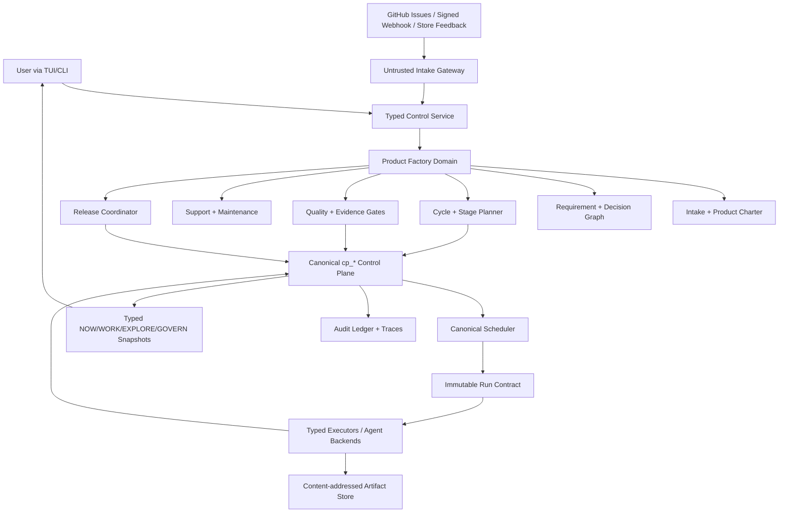

# R-AI-OS Factory Mode — Product Lifecycle Master Plan

**Status:** Draft for architecture approval
**Date:** 2026-07-18
**Target:** R-AI-OS v3.6.x+
**Primary pilot:** Greenfield React Native product delivered to Google Play Closed Testing and Apple TestFlight
**Implementation state:** Planning only; no Factory Mode business logic is authorized by this document

---

## 1. Executive Decision

R-AI-OS Factory Mode will be a human-governed product operating system that manages the complete lifecycle of a living product:

```text
Discover → Define → Research → Design → Plan → Build → Verify
→ Release → Operate → Support → Maintain → Improve ↺
```

Factory Mode is not a one-shot code generator and is not a second agent scheduler. It is a typed product-domain layer above the existing R-AI-OS control plane. The control plane remains the authority for tasks, agent runs, run contracts, artifacts, approvals, budgets, policies, and audit history.

The product remains active after its first release. New requirements, user feedback, defects, maintenance findings, and policy changes create new product cycles. A product is long-lived; cycles and releases are the units that complete.

The first end-to-end pilot will deliberately begin without a preselected app idea. Factory Mode must help the user discover, challenge, and define the product before producing it. The pilot succeeds only when real testers can access signed builds through Google Play Closed Testing and Apple TestFlight and their feedback can enter the next product cycle.

---

## 2. Confirmed Product Requirements

### 2.1 User and distribution model

- The initial user is the local R-AI-OS owner.
- A future public/multi-user product is expected, but public SaaS is outside the first delivery.
- Ownership and workspace boundaries must exist in the model from the beginning to avoid a destructive multi-tenant migration later.
- The same Factory core must support local and self-hosted server deployment.
- TUI is the first primary interface.
- A web interface is a later projection over the same contracts, not a separate backend.

### 2.2 Intake and requirements

- The user starts in natural language and does not need to provide a complete specification.
- Factory asks only questions whose answers materially affect scope, safety, feasibility, cost, or success criteria.
- Related questions are batched.
- Previously resolved information is not requested again unless a later change invalidates it.
- Defaultable details receive visible, reversible defaults.
- The intake output is a versioned Product Charter plus structured requirements.
- New requirements may arrive throughout the product lifetime.

### 2.3 Product scope

Factory is responsible for more than software implementation. Its product scope includes:

- problem and target-user discovery;
- product and competitor research;
- value proposition and product strategy;
- measurable success criteria;
- UX flows and interaction design;
- visual language, design system, brand, and content;
- architecture and stack selection;
- implementation and infrastructure;
- security, privacy, accessibility, performance, and quality;
- documentation and operational readiness;
- store/release preparation and submission;
- support intake and feedback processing;
- maintenance, dependency health, and subsequent releases.

### 2.4 Decision behavior

- Factory recommends a path and explains why.
- The user has final authority over product and technical preferences.
- When a requested change conflicts with an approved goal or decision, Factory first shows the warning and affected areas.
- Detailed alternatives are generated when requested or when no safe implementation path exists.
- User override is allowed after impact disclosure.
- An override cannot bypass hard safety invariants such as secret exposure prevention, workspace boundaries, or destructive-action confirmation.
- Approved objects are not silently edited. Changes create revisions, superseding links, and a new impact record.

### 2.5 Completeness

“Complete” means the appropriate set of product artifacts exists and is verified. It does not mean only that source code compiles.

The expected output may include:

- source repository and reproducible setup;
- Product Charter and requirements;
- research evidence and citations;
- UX flows and design system;
- architecture decisions and threat model;
- implementation and tests;
- CI/CD configuration;
- security, dependency, license, accessibility, and performance evidence;
- environment and secret-reference documentation;
- migration, backup, and rollback plans when stateful;
- release notes and store metadata;
- signed release artifacts;
- monitoring and support configuration;
- maintenance schedule and ownership trail.

### 2.6 Support and maintenance behavior

- Factory may run locally or continuously on a server.
- The default behavior is observe, classify, notify, and report.
- A project policy or explicit user request may authorize preparation of a fix package.
- Merge, deployment, migration, rollback, store submission, paid-resource creation, and destructive operations require explicit approval by default.
- Initial support sources are TUI/manual intake, GitHub Issues, and a signed generic webhook.
- Email, chat, and specialized support platforms are later adapters.
- External feedback is untrusted data and never becomes executable agent instruction.

### 2.7 Interaction quality

Factory must not be more tiring than completing the same work through a normal AI conversation.

The UX therefore must:

- show a useful draft before requesting optional detail;
- ask only consequential questions;
- explain why a blocking question matters;
- persist and resume every intake and product cycle;
- acknowledge long-running work quickly and execute it asynchronously;
- show concise product-level state by default;
- expose agent, model, run-contract, cost, and trace detail progressively;
- avoid repeated configuration for established user preferences;
- provide safe defaults and one-place policy controls.

---

## 3. Non-Goals for the First Release

The first release will not attempt to provide:

- a public multi-tenant SaaS;
- a web dashboard;
- production-grade adapters for every software ecosystem;
- unrestricted autonomous production changes;
- arbitrary shell execution derived from natural-language or external support input;
- every support-channel integration;
- automatic legal certification or a claim of definitive legal advice;
- guaranteed tester recruitment or guaranteed store approval;
- fully autonomous product strategy without user approval;
- binary artifact storage inside the canonical SQLite database.

---

## 4. Current-System Audit

### 4.1 Reusable foundations already present

R-AI-OS already provides most orchestration primitives Factory Mode requires:

| Required capability | Existing foundation |
|---|---|
| Canonical work state | `cp_tasks`, `cp_agent_runs`, `cp_artifacts`, `cp_approvals` |
| Dependency execution | `cp_task_edges`, `cp_task_graphs`, `GraphStore` |
| Deterministic execution scope | `cp_run_contracts` |
| Budget decisions | `cp_budget_ledger`, `BudgetGate` |
| Human gates | approval workflows and risk-scored inbox |
| Agent dispatch | canonical scheduler and agent runner |
| Security enforcement | policy, capability declaration, UMAI, egress filter, secret leases |
| Forensic history | hash-chained audit ledger and tool traces |
| Background work | daemon scheduler and cron jobs |
| User surface | typed `NOW`, `WORK`, `EXPLORE`, `GOVERN` snapshots |
| Project operations | new/build/test/security/deps/license/CI/pre-flight commands |
| Learning | memory items, instincts, evolution candidates, trace recall |

These primitives must be reused. Factory Mode must not create an independent task database, scheduler, approval queue, agent-run model, or audit mechanism.

### 4.2 Existing `Factory` is not the requested Product Factory

`crates/raios-runtime/src/factory.rs` currently implements an asynchronous heavy-job queue:

- `Job` + `JobStatus`;
- immediate job ID return;
- Tokio background execution;
- `factory_jobs` persistence;
- broadcast completion events;
- optional webhook notification.

It is used by daemon job commands and task-graph execution. It is valuable as a low-level execution primitive, but it is not a product lifecycle domain.

The current daemon job surface also accepts `shell_cmd`. That behavior must not become the Product Factory execution contract. External feedback, model output, and product requirements cannot be concatenated into commands. Product work must compile into typed execution kinds, validated payloads, capability checks, and immutable run contracts.

### 4.3 Naming decision

The user-facing term `Factory` is reserved for Product Factory.

The existing runtime queue will be migrated toward the internal name `JobExecutor`:

1. move implementation to the proposed `crates/raios-runtime/src/job_executor.rs`;
2. retain a temporary compatibility re-export from the existing `crates/raios-runtime/src/factory.rs`;
3. update internal call sites and tests;
4. keep legacy daemon protocol behavior during the deprecation window;
5. remove the alias only in a separately approved breaking release.

No product-domain table may use legacy `factory_jobs` as its source of truth.

### 4.4 Typed TUI foundation

The TUI already has four stable routes:

- `NOW`: attention, approvals, blockers, and active runs;
- `WORK`: projects, tasks, runs, and project detail;
- `EXPLORE`: search, traces, logs, and evidence;
- `GOVERN`: policy, audit, health, and schedules.

Factory Mode should deepen these routes rather than add a fifth top-level route. Product-specific subviews and detail modes belong inside the existing information architecture.

### 4.5 React Native gap

The current build detector recognizes Node, Android, iOS, Flutter, and other ecosystems, but React Native is not a first-class project type. A React Native repository is likely to be classified as generic Node before its native Android/iOS capabilities are modeled.

The pilot therefore requires:

- `ProjectType::ReactNative`;
- Expo and bare React Native detection;
- native platform capability detection;
- package-manager-aware commands;
- Android/iOS build and test composition;
- local/remote build-host capability reporting;
- store submission adapters.

### 4.6 Ownership gap

The typed control service currently distinguishes a mutable local owner from a read-only remote subject, but it does not yet implement full workspace membership and per-product authorization.

Self-hosted remote mutation and future public use require:

- authenticated principal identity supplied by transport, never by request payload;
- workspace ownership/membership;
- product and project scoping;
- approval ownership;
- role/capability checks at every command boundary;
- query scoping that prevents cross-workspace disclosure.

Single-user local mode may use a seeded local workspace and owner principal, but the schema must not assume that all rows are globally visible.

### 4.7 Database readiness gap

The shared `workspace.db` is approximately 2.94 GB, above the configured 500 MB soft cap. Read-only `dbstat` measurement attributes most growth to rebuildable search structures:

| Structure | Approximate size |
|---|---:|
| `idx_trigram_file` | 775.90 MB |
| `trigram_postings` | 650.91 MB |
| `idx_trigram` | 629.89 MB |
| `idx_trigram_postings_file` | 512.63 MB |
| `bm25_postings` | 152.17 MB |
| Remaining BM25 indexes | ~50.88 MB |
| `cortex_chunks` | 14.24 MB |
| `audit_log` | 1.10 MB |

Factory Mode will create long-lived metadata and evidence references. It must not be introduced into an already unbounded single-file storage model without storage budgets and retention rules.

The target storage layout is:

```text
~/.config/raios/
├── workspace.db          # durable control plane, memory metadata, Factory metadata
├── search.db             # rebuildable trigram/BM25/Cortex cache
├── artifacts/            # content-addressed reports, logs, manifests, binaries by policy
└── snapshots/            # bounded recovery snapshots / migration backup metadata
```

Database splitting is a migration, not a cleanup command. It requires backup, copy, validation, rollback, and explicit user authorization before any old cache tables are dropped or vacuumed.

### 4.8 Dirty-worktree constraint

At planning time, the repository is one commit ahead of `origin/master`, and `README.md` plus `memory.md` contain pre-existing user changes. Factory implementation work must preserve them and must not assume a clean worktree until ownership is resolved.

---

## 5. Architecture Principles

### 5.1 Product truth is typed state

Important product objects are database entities with explicit state transitions. Chat transcripts, Markdown, agent summaries, and shell output are supporting artifacts, not authoritative state.

### 5.2 Products live; cycles complete

A product has a durable identity. Initial development, features, defects, maintenance, support responses, and releases are represented as separate cycles linked to the same product.

### 5.3 Proposals precede mutations

Agents propose charters, requirements, decisions, plans, patches, and impact assessments. The control plane validates and records them. Only an approved transition can mutate protected product or project state.

### 5.4 Evidence closes work

A task or stage is not complete because an agent says it is complete. Required evidence must exist, be current, and pass the applicable quality gate.

### 5.5 Approved records are immutable

Approved charter, requirement, decision, plan, quality-profile, and release-manifest versions are immutable. Changes create a new revision or a superseding record.

### 5.6 One writer authority

Local, self-hosted, TUI, CLI, MCP, HTTP, and future web surfaces use the same control service. Offline fallback must not create a competing write path or split-brain product state.

### 5.7 External input is hostile by default

Research pages, GitHub issues, webhook payloads, support messages, store feedback, and generated agent text are untrusted. They are data to normalize and review, never direct commands.

### 5.8 Deny by default

Network access, secret use, filesystem scope, paid resources, production changes, store submission, and destructive actions remain denied unless a policy and approval explicitly allow them.

### 5.9 Progressive disclosure

The default UI shows product progress and the next decision. Agent names, models, raw contracts, logs, and token detail are available without dominating the main workflow.

### 5.10 Current-source rules

Store policies, legal requirements, framework constraints, service prices, and security recommendations are time-sensitive. Factory records source URL, retrieval time, jurisdiction/scope, and freshness. Stale policy evidence cannot silently authorize a release.

---

## 6. Target Architecture



### 6.1 Layer responsibilities

| Layer | Owns | Must not own |
|---|---|---|
| Contracts | serialized queries, commands, events, DTOs | database or executor logic |
| Core domain | types, invariants, state machines, impact rules | subprocesses or TUI rendering |
| DB workflows | atomic persistence and read models | agent reasoning |
| Runtime Factory service | intake orchestration, planning, gates, adapters | raw cross-workspace SQL |
| Control service | auth actor, idempotency, command authorization | UI-specific state |
| Scheduler | runnable task selection and retry policy | product-strategy decisions |
| Executors | bounded implementation/build/test actions | lifecycle authority |
| TUI | projection and user gestures | direct database writes |
| Artifact store | content blobs and integrity metadata | canonical lifecycle state |

---

## 7. Canonical Domain Model

### 7.1 Workspace

`cp_workspaces` establishes the future-proof ownership boundary.

Minimum fields:

- `id`;
- `name`;
- `owner_subject`;
- `status`;
- `default_policy_id`;
- `created_at`;
- `updated_at`.

Initial migration creates one `local-default` workspace owned by the authenticated local control owner.

### 7.2 Canonical Plan

`cp_plans` fills the existing control-plane gap: `cp_tasks.plan_id` currently has no canonical plan entity.

Minimum fields:

- `id`;
- `workspace_id`;
- `project_id`;
- `title`;
- `goal`;
- `source_kind`;
- `source_ref`;
- `status`;
- `created_by`;
- `approved_by`;
- `created_at`;
- `updated_at`.

Plan states:

```text
draft → ready → approved → running → completed
   └────────────→ cancelled
```

Approved plans are immutable. Replanning creates a new plan that supersedes the old plan.

### 7.3 Product

`cp_factory_products` is the long-lived product identity.

Minimum fields:

- `id`;
- `workspace_id`;
- `project_id` (nullable before import/scaffold);
- `name`;
- `slug`;
- `product_kind`;
- `status`;
- `active_charter_revision_id`;
- `automation_policy_id`;
- `quality_profile_id`;
- `created_by`;
- `created_at`;
- `updated_at`.

Product states are deliberately small:

```text
draft → active ↔ paused → archived
```

Build/release progress does not overload product state; it belongs to cycles and releases.

### 7.4 Intake session

`cp_factory_intake_sessions` stores resumable discovery sessions.

Minimum fields:

- `id`;
- `product_id`;
- `cycle_id` (nullable for first discovery);
- `status`;
- `started_by`;
- `completeness_json`;
- `unresolved_blockers_json`;
- `transcript_artifact_id`;
- `started_at`;
- `updated_at`;
- `completed_at`.

`cp_factory_intake_items` stores structured question/answer pairs:

- `id`;
- `session_id`;
- `topic`;
- `question`;
- `why_it_matters`;
- `blocking`;
- `status`;
- `answer`;
- `assumption_used`;
- `affected_fields_json`;
- `asked_at`;
- `answered_at`.

This table prevents repeated questions and makes assumptions inspectable.

### 7.5 Product Charter revision

`cp_factory_charter_revisions` stores immutable charter versions.

Minimum fields:

- `id`;
- `product_id`;
- `revision_number`;
- `status`;
- `problem_statement`;
- `target_users_json`;
- `value_proposition`;
- `desired_outcomes_json`;
- `success_metrics_json`;
- `hard_constraints_json`;
- `soft_preferences_json`;
- `explicit_non_goals_json`;
- `risk_context_json`;
- `source_session_id`;
- `supersedes_id`;
- `created_by`;
- `approved_by`;
- `created_at`;
- `approved_at`.

States:

```text
draft → review → approved → superseded
             └→ rejected
```

Only one approved charter revision may be active per product.

### 7.6 Requirement and requirement revision

`cp_factory_requirements` stores stable requirement identity:

- `id`;
- `product_id`;
- `requirement_key`;
- `kind`;
- `status`;
- `current_revision_id`;
- `created_at`;
- `updated_at`.

`cp_factory_requirement_revisions` stores immutable content:

- `id`;
- `requirement_id`;
- `revision_number`;
- `title`;
- `statement`;
- `rationale`;
- `acceptance_criteria_json`;
- `priority`;
- `risk_level`;
- `source_kind`;
- `source_ref`;
- `supersedes_id`;
- `created_by`;
- `created_at`.

Requirement states:

```text
proposed → needs_input → accepted → implementing → verified
                    ├→ deferred
                    ├→ rejected
                    └→ superseded
```

### 7.7 Requirement dependency graph

`cp_factory_requirement_links` provides explicit edges:

- `source_requirement_id`;
- `target_requirement_id`;
- `relation`;
- `reason`;
- `created_by`;
- `created_at`.

Allowed relations:

- `depends_on`;
- `conflicts_with`;
- `derived_from`;
- `duplicates`;
- `blocks`;
- `validates`;
- `supersedes`.

Graph validation rejects self-links, invalid references, and dependency cycles where the relation requires a DAG.

### 7.8 Decision record

`cp_factory_decisions` stores product and architecture decisions:

- `id`;
- `product_id`;
- `cycle_id`;
- `decision_kind`;
- `title`;
- `context`;
- `decision`;
- `rationale`;
- `consequences_json`;
- `status`;
- `supersedes_id`;
- `source_artifact_id`;
- `decided_by`;
- `created_at`.

States:

```text
proposed → accepted → superseded
        └→ rejected
```

User preferences and hard safety constraints are distinct decision kinds. A preference may be overridden; a hard invariant requires a policy change with elevated approval.

### 7.9 Product cycle

`cp_factory_cycles` represents a bounded unit of product change.

Minimum fields:

- `id`;
- `product_id`;
- `cycle_number`;
- `cycle_kind`;
- `goal`;
- `status`;
- `source_change_request_id`;
- `charter_revision_id`;
- `plan_id`;
- `target_release_id`;
- `started_at`;
- `completed_at`;
- `created_at`.

Cycle kinds:

- `initial_product`;
- `feature`;
- `defect`;
- `support`;
- `maintenance`;
- `security`;
- `compliance`;
- `release`.

Cycle states:

```text
intake → analyzing → planned → awaiting_approval → approved
→ executing → verifying → release_ready → releasing
→ observing → completed
```

Any active state may transition to `blocked`, `paused`, `cancelled`, or `failed` under explicit rules. A failed cycle is not rewritten; a recovery cycle or new attempt preserves history.

### 7.10 Stage run

`cp_factory_stage_runs` instantiates lifecycle stages for a cycle.

Minimum fields:

- `id`;
- `cycle_id`;
- `stage_kind`;
- `ordinal`;
- `status`;
- `attempt`;
- `task_graph_id`;
- `required_gate_set_json`;
- `summary_artifact_id`;
- `started_at`;
- `completed_at`.

Stage kinds:

- `discover`;
- `define`;
- `research`;
- `design`;
- `plan`;
- `build`;
- `verify`;
- `release`;
- `operate`;
- `support`;
- `maintain`.

Stage states:

```text
pending → ready → running → verifying → passed
                 ├→ waiting_input
                 ├→ waiting_approval
                 ├→ blocked
                 └→ failed
```

Skipped stages require a recorded reason and, when the quality profile marks the stage mandatory, a risk-override approval.

### 7.11 Stage task mapping

`cp_factory_stage_tasks` maps a product stage to canonical tasks:

- `stage_run_id`;
- `task_id`;
- `purpose`;
- `required`;
- `created_at`.

Factory does not execute stage logic directly. It materializes canonical plans, tasks, edges, and run contracts, then observes canonical outcomes.

### 7.12 Change request

`cp_factory_change_requests` normalizes all new product work:

- `id`;
- `product_id`;
- `source_kind`;
- `source_ref`;
- `request_kind`;
- `title`;
- `normalized_description`;
- `status`;
- `priority`;
- `risk_level`;
- `dedupe_hash`;
- `untrusted_payload_artifact_id`;
- `impact_assessment_id`;
- `created_by`;
- `created_at`;
- `updated_at`.

Source kinds include `user`, `support`, `github_issue`, `signed_webhook`, `maintenance`, `security_scan`, and `store_feedback`.

### 7.13 Impact assessment

`cp_factory_impact_assessments` records the warning shown before a conflicting or broad change:

- `id`;
- `change_request_id`;
- `base_charter_revision_id`;
- `status`;
- `risk_level`;
- `effort_class`;
- `affected_summary`;
- `impact_artifact_id`;
- `created_by`;
- `created_at`;
- `approved_by`;
- `approved_at`.

The referenced impact artifact contains typed affected sets:

- charter fields;
- requirements;
- decisions;
- code modules;
- tests;
- documentation;
- infrastructure;
- migrations/data;
- external services;
- privacy/compliance;
- store metadata;
- cost/budget;
- release schedule.

### 7.14 Evidence link

`cp_factory_evidence_links` reuses canonical `cp_artifacts`:

- `scope_kind`;
- `scope_id`;
- `artifact_id`;
- `evidence_kind`;
- `required`;
- `freshness_policy_json`;
- `status`;
- `created_at`.

Large content lives in the artifact store. The database retains immutable references, hashes, media type, size, producer, and integrity metadata.

### 7.15 Quality profile and checks

`cp_factory_quality_profiles` stores versioned product quality policy:

- `id`;
- `product_id`;
- `version`;
- `risk_class`;
- `required_checks_json`;
- `thresholds_json`;
- `supported_platforms_json`;
- `freshness_rules_json`;
- `status`;
- `created_at`;
- `approved_at`.

`cp_factory_quality_checks` stores actual evaluations:

- `id`;
- `scope_kind`;
- `scope_id`;
- `check_kind`;
- `status`;
- `tool_name`;
- `tool_version`;
- `artifact_id`;
- `started_at`;
- `completed_at`;
- `expires_at`.

### 7.16 Release

`cp_factory_releases` represents a release candidate and its channels:

- `id`;
- `product_id`;
- `cycle_id`;
- `version_name`;
- `build_number`;
- `status`;
- `release_manifest_artifact_id`;
- `quality_snapshot_artifact_id`;
- `created_at`;
- `submitted_at`;
- `completed_at`.

`cp_factory_release_channels` stores per-channel status:

- `id`;
- `release_id`;
- `provider`;
- `channel`;
- `external_app_ref`;
- `external_release_ref`;
- `status`;
- `policy_snapshot_artifact_id`;
- `last_checked_at`;
- `submitted_at`;
- `available_at`.

Initial providers are Google Play Closed Testing and Apple TestFlight.

### 7.17 Support item

`cp_factory_support_items` stores sanitized support state:

- `id`;
- `product_id`;
- `source_kind`;
- `external_ref`;
- `kind`;
- `severity`;
- `status`;
- `normalized_summary`;
- `untrusted_payload_artifact_id`;
- `change_request_id`;
- `dedupe_hash`;
- `received_at`;
- `triaged_at`;
- `closed_at`.

Reporter PII is minimized, redacted, and never written to general logs.

### 7.18 Automation policy

`cp_factory_automation_policies` implements per-product behavior:

- `id`;
- `workspace_id`;
- `product_id`;
- `mode`;
- `allowed_low_risk_actions_json`;
- `mandatory_approvals_json`;
- `soft_budget_json`;
- `hard_budget_json`;
- `maintenance_schedule_json`;
- `notification_policy_json`;
- `created_at`;
- `updated_at`.

Modes:

- `observe`: detect, classify, and report;
- `prepare`: also create an isolated fix package and evidence;
- `guarded_execute`: apply approved, policy-bounded changes;
- `autopilot`: reserved for future low-risk allowlisted work and disabled in MVP.

### 7.19 Integration record

`cp_factory_integrations` stores configuration metadata, never raw credentials:

- `id`;
- `workspace_id`;
- `product_id`;
- `provider`;
- `capabilities_json`;
- `external_account_ref`;
- `secret_lease_ref`;
- `status`;
- `last_verified_at`;
- `metadata_json`.

### 7.20 Domain event stream

`cp_factory_events` provides a product timeline:

- `id`;
- `workspace_id`;
- `product_id`;
- `cycle_id`;
- `event_kind`;
- `actor_subject`;
- `correlation_id`;
- `payload_json`;
- `created_at`.

High-risk transitions are also anchored in the existing security audit ledger. Product events do not replace the tamper-evident audit chain.

---

## 8. Core State-Machine Invariants

### 8.1 General transition rule

Every mutation follows:

```text
Authenticated actor
→ ownership/capability authorization
→ current-state validation
→ prerequisite/gate validation
→ idempotency check
→ one database transaction
→ domain event
→ audit event when required
→ typed event/snapshot refresh
```

### 8.2 Completion rule

A stage may enter `passed` only when:

1. all required canonical tasks are terminal-success;
2. all required evidence links resolve to valid artifacts;
3. evidence freshness requirements pass;
4. mandatory quality checks pass;
5. no unresolved blocker exists;
6. required human approvals are approved;
7. budget and policy gates permit transition.

### 8.3 Retry rule

- Retrying work creates a new `AgentRun`.
- Retrying a stage increments `attempt` and retains earlier evidence/history.
- A failed artifact is never overwritten.
- Superseded evidence remains queryable.

### 8.4 Requirement-change rule

An accepted requirement cannot be modified in place:

```text
New request
→ normalize/dedupe
→ impact assessment
→ show warning + affected areas
→ user confirms intent
→ new requirement revision / decision
→ mark impacted evidence stale
→ create approved plan and cycle tasks
```

### 8.5 User override rule

User override records:

- original recommendation;
- disclosed risk and affected objects;
- user decision;
- required compensating controls;
- approval identity and timestamp.

Override may alter preferences and product decisions. It cannot authorize path traversal, plaintext-secret persistence, cross-workspace access, an invalid cryptographic practice, or an unconfirmed destructive action.

### 8.6 Release rule

Store submission requires a release-scoped approval bound to:

- exact source commit;
- exact build artifact hash;
- exact version/build number;
- exact target store/channel;
- current quality snapshot;
- current store-policy evidence;
- active secret-lease references;
- expected cost and external effects.

Approval for one build cannot be replayed for another.

---

## 9. Intake and Product-Charter Engine

### 9.1 Intake topic matrix

Factory evaluates whether the following areas are known, defaultable, irrelevant, or blocking:

- problem statement;
- target users;
- desired outcome;
- success metrics;
- explicit non-goals;
- supported platforms;
- core workflows;
- data model and data sensitivity;
- authentication and authorization;
- third-party integrations;
- offline/sync requirements;
- business model and paid services;
- accessibility expectations;
- performance expectations;
- jurisdiction and compliance context;
- release channels;
- support/maintenance expectations;
- budget and timing constraints.

### 9.2 Question policy

A question is blocking only when its answer changes one or more of:

- whether the product is feasible;
- the trust/risk class;
- architecture or platform selection;
- irreversible external setup;
- legal/privacy obligations;
- acceptance criteria;
- material cost;
- release eligibility.

Non-blocking unknowns receive a recorded assumption and may be revisited.

### 9.3 Charter generation

The Charter generator produces a structured proposal plus a concise human-readable rendering. It must separate:

- confirmed user statements;
- system recommendations;
- inferred assumptions;
- unresolved risks;
- deferred questions.

The user approves the Charter before the first implementation plan is runnable.

### 9.4 Research behavior

Research tasks must:

- prefer primary/current sources;
- record direct source links and retrieval timestamps;
- distinguish sourced facts from inference;
- respect source quotation/licensing limits;
- treat fetched content as untrusted;
- record market conclusions as proposals, not objective truth;
- invalidate time-sensitive results after their freshness window.

---

## 10. Impact Engine

### 10.1 Purpose

The impact engine implements the user requirement that connected concerns update together. It prevents a request from changing code while leaving requirements, tests, documentation, infrastructure, or release metadata stale.

### 10.2 Inputs

- current approved Charter;
- accepted requirements and dependency edges;
- accepted decisions;
- current code/import/call graph;
- existing test coverage and quality profile;
- infrastructure and integration manifests;
- release/store metadata;
- support and maintenance state;
- latest evidence freshness.

### 10.3 Outputs

The first response is intentionally concise:

- conflict/warning summary;
- affected areas;
- risk level;
- whether confirmation is required.

On request, Factory expands:

- alternatives;
- effort class;
- migration strategy;
- rollback strategy;
- budget effect;
- task graph proposal;
- release impact.

### 10.4 Staleness propagation

Approved change invalidates only evidence that depends on the changed object. Example:

```text
Authentication decision changes
→ auth requirements revised
→ architecture decision superseded
→ threat model stale
→ auth tests stale
→ privacy/data-flow evidence stale
→ store data-safety answers require review
→ release readiness returns to blocked
```

Staleness is explicit state, not deletion.

---

## 11. Planning and Task Materialization

### 11.1 Planner contract

The planner receives:

- approved Charter revision;
- accepted requirement revisions;
- impact assessment;
- target adapter capabilities;
- automation and quality policies;
- budgets;
- project/repository state.

It produces:

- immutable plan proposal;
- ordered stage instances;
- canonical tasks;
- dependency edges;
- expected artifact kinds;
- success criteria;
- run-contract templates;
- gate requirements;
- risk and budget summary.

### 11.2 Plan validation

Before approval, deterministic validators check:

- every accepted requirement is covered by a task or explicit non-code artifact;
- every task has acceptance criteria;
- dependencies form valid DAGs;
- every destructive/external task has an approval gate;
- every task has a compatible executor/provider;
- expected artifacts have a storage policy;
- budgets are present or explicitly unknown;
- release tasks include rollback/recovery where applicable.

### 11.3 Task-graph scaling

The existing task graph has bounded node/depth behavior. Product cycles must not bypass those limits by creating one enormous graph.

Factory uses hierarchical orchestration:

```text
Product cycle
└── Stage runs
    └── bounded canonical task graphs
        └── immutable agent runs
```

Each stage graph remains bounded and independently recoverable.

---

## 12. Execution Architecture

### 12.1 Typed execution kinds

Factory tasks compile into allowlisted execution kinds such as:

- `AgentTask`;
- `CoreBuild`;
- `CoreTest`;
- `SecurityScan`;
- `DependencyScan`;
- `LicenseScan`;
- `PreFlight`;
- `ExtensionCommand`;
- `StoreBuild`;
- `StoreSubmit`;
- `SignedWebhookIngest`;
- `ReadOnlyResearch`.

Each kind has a typed payload schema. Free-form shell is not a Product Factory execution kind.

### 12.2 Run contracts

Every execution attempt materializes a real `cp_run_contracts` row containing:

- canonical workspace root;
- allowed and blocked paths;
- allowed tool capabilities;
- network allowlist/deny policy;
- token/time/CPU/memory budgets;
- expected artifacts;
- success criteria;
- escalation policy.

### 12.3 Scheduler behavior

The canonical scheduler selects only tasks that are:

- `ready`;
- dependency-satisfied;
- not approval-blocked;
- lock-compatible;
- capability-compatible;
- within provider and contract budgets;
- owned by the active workspace/product;
- not paused/cancelled by product policy.

### 12.4 Crash recovery

On daemon restart:

- stale claimed work is reconciled;
- external build/submission jobs are polled by external ID instead of blindly resubmitted;
- idempotency keys prevent duplicate external effects;
- incomplete local agent runs become interrupted/failed according to policy;
- resumable stages return to an explicit recovery state;
- no stage is marked passed based only on a lost process.

---

## 13. Artifact and Evidence Storage

### 13.1 Content-addressed storage

Artifact content is stored by SHA-256 digest outside SQLite:

```text
artifacts/<first-two-hash-bytes>/<full-hash>
```

Database metadata includes:

- hash;
- size;
- media type;
- producer run;
- source commit;
- created time;
- sensitivity class;
- retention class;
- optional encryption metadata;
- integrity verification status.

### 13.2 Retention classes

- `canonical`: approved charters, decisions, release manifests; retained indefinitely unless the user deletes the product;
- `release`: build/store evidence; retained per release policy;
- `operational`: logs and traces; bounded by age and size;
- `cache`: rebuildable search/research cache; freely rebuildable;
- `sensitive`: minimized, encrypted when required, short retention, never general-indexed.

### 13.3 Secret rule

Credentials, signing secrets, API keys, and service-account JSON are not artifacts. They remain in platform credential stores or R-AI-OS secret leases. Artifacts may reference a lease identifier but never contain the secret value.

---

## 14. Quality and Governance Model

### 14.1 Risk classes

Factory derives a proposed risk class from product data and asks for confirmation when uncertain:

| Class | Example | Additional expectations |
|---|---|---|
| Low | static/content product | baseline security, accessibility, performance |
| Standard | normal app without sensitive data | auth/data-flow checks when applicable, integration/E2E evidence |
| Sensitive | PII, payments, location, private content | threat model, stronger access-control tests, privacy review, recovery plan |
| Regulated | health, finance, children, legally regulated workflows | current jurisdiction research, specialist-review gate, strict evidence retention |

### 14.2 Baseline quality gates

Every shipped product requires applicable evidence for:

- acceptance criteria;
- unit/integration/end-to-end tests;
- build reproducibility;
- lint/type/static analysis;
- secret scanning;
- dependency vulnerabilities;
- dependency licenses;
- authorization and ownership boundaries;
- performance budgets;
- accessibility expectations;
- privacy/data-flow declarations;
- documentation;
- rollback/recovery;
- monitoring and support readiness.

### 14.3 Legal/compliance behavior

Factory can research requirements, produce implementation tasks, generate drafts, and track evidence. It must:

- ask for target jurisdictions and user categories;
- cite current authoritative sources;
- mark uncertainty and effective dates;
- request specialist review for high-risk claims;
- avoid representing generated drafts as definitive legal advice;
- revalidate stale requirements before release.

---

## 15. React Native Pilot Adapter

### 15.1 Framework decision

The default pilot recommendation is Expo + React Native + TypeScript with EAS Build/Submit because it enables Android and iOS production build workflows from the current Linux-centered environment.

This is a recommendation, not a hard constraint. Intake may select bare React Native when requirements demand native functionality not served by the Expo path. That change must expose its macOS/build/signing impact.

### 15.2 Project detection

Add `ProjectType::ReactNative` before generic Node detection when:

- the target product's Node package manifest contains `react-native` or Expo dependencies;
- Expo config or native `android/`/`ios/` roots exist;
- platform tooling is consistent with the selected profile.

Detection returns capabilities, not only a label:

- Expo managed/prebuild/bare;
- Android project present;
- iOS project present;
- package manager;
- TypeScript;
- EAS configuration;
- local Android toolchain;
- local/remote macOS capability;
- signing readiness.

### 15.3 Scaffold profile

The greenfield pilot scaffold must include:

- TypeScript strict configuration;
- environment schema and documented keys;
- no plaintext secrets;
- navigation and error boundaries;
- feature-oriented module structure;
- test harness;
- lint/format/type-check scripts;
- CI workflow;
- EAS profiles for development, preview, and production;
- Android package and iOS bundle identifiers;
- version/build-number strategy;
- privacy/telemetry configuration appropriate to the selected product;
- README, architecture, Product Charter reference, and memory trail.

The exact application features remain unknown until Factory runs the pilot intake.

### 15.4 Verification profile

The pilot’s release candidate requires, as applicable:

- TypeScript type check;
- lint and formatting verification;
- unit tests;
- integration tests;
- critical-flow E2E tests on Android and iOS-compatible infrastructure;
- dependency, license, and secret scans;
- Android release bundle build;
- iOS release archive build;
- accessibility review of critical flows;
- startup/runtime performance evidence;
- crash/error reporting readiness;
- backend migration/recovery evidence when a backend exists;
- signed artifact hash capture.

### 15.5 Build-host strategy

The current Linux host cannot natively perform every iOS signing/build operation. Factory therefore models build providers as capabilities:

- local Android build;
- EAS hosted Android/iOS build;
- macOS CI runner;
- future self-hosted macOS worker.

Provider selection considers cost, availability, security, and product requirements. Paid hosted execution requires budget approval.

### 15.6 Store submission facts that affect the plan

- Expo documents EAS Build and EAS Submit workflows for Google Play and Apple App Store submission from CLI/CI.
- Store developer accounts and signing credentials remain prerequisites.
- Google Play submission uses an Android App Bundle for store delivery.
- Apple TestFlight requires a build uploaded to App Store Connect and may require beta review for external testing.
- Some newer personal Google Play developer accounts must satisfy a minimum closed-testing period/tester rule before production access; Factory must fetch the current account-specific rule rather than assume a permanent constant.

Current official references:

- [Expo: Submit to app stores](https://docs.expo.dev/deploy/submit-to-app-stores/)
- [Expo: Build projects for app stores](https://docs.expo.dev/deploy/build-project/)
- [Apple: TestFlight overview](https://developer.apple.com/help/app-store-connect/test-a-beta-version/testflight-overview/)
- [Google Play: Testing requirements for new personal developer accounts](https://support.google.com/googleplay/android-developer/answer/14151465)

### 15.7 Store readiness artifacts

Factory prepares and verifies:

- app name and identifiers;
- icon and splash assets;
- screenshots for required device classes;
- short and full descriptions;
- category and age/target-audience answers;
- privacy-policy URL/content;
- data-safety/privacy declarations derived from actual code and services;
- encryption/export-compliance answers based on actual cryptographic use;
- tester instructions and feedback channel;
- release notes;
- support contact;
- signed build artifacts;
- store submission manifest;
- rollback/expiry response plan.

Factory must not invent store/privacy answers. Unknown answers remain blockers.

### 15.8 Submission gates

Actual submission requires:

1. release candidate frozen to a commit and artifact hash;
2. mandatory quality checks passed;
3. store metadata complete;
4. account and signing capability verified;
5. secret leases available;
6. cost/external-side-effect summary displayed;
7. explicit channel-bound user approval;
8. idempotency key persisted before submission;
9. external submission ID persisted immediately;
10. post-submit status polling and user-visible outcome.

### 15.9 Pilot Definition of Done

The pilot is complete only when:

- Factory helps define the previously undecided product idea;
- the Product Charter is approved;
- requirements and decisions are traceable;
- a greenfield React Native repository is created;
- implementation passes the approved quality profile;
- Android and iOS signed builds are produced;
- required store assets and policy answers exist;
- the Android build is available to selected Google Play closed testers;
- the iOS build is available to selected TestFlight testers;
- at least one feedback item from the testing cycle is ingested;
- that feedback is normalized, impact-assessed, and converted into a new product cycle proposal;
- the full history is visible in TUI and auditable from canonical state.

Tester recruitment and external store approval timing are recorded external dependencies, not falsified as Factory-controlled outcomes.

---

## 16. Support and Maintenance Engine

### 16.1 Initial intake adapters

#### Manual/TUI

- trusted authenticated user input;
- creates a normalized change request directly;
- still requires impact assessment for accepted-product changes.

#### GitHub Issues

- read through authenticated, least-privilege integration;
- repository allowlist;
- issue ID used for idempotency;
- body treated as untrusted;
- duplicate detection before creating a support item;
- no automatic comment/write action in MVP.

#### Signed generic webhook

- provider-specific secret lease;
- HMAC verification using a standard library;
- timestamp window and nonce/replay protection;
- strict content type and size limits;
- rate limiting;
- schema validation;
- safe payload archival with sensitivity policy;
- no URL supplied by the payload is fetched automatically.

### 16.2 Triage

Triage produces:

- kind: defect, feature, question, incident, abuse, duplicate;
- severity and urgency;
- reproducibility/confidence;
- affected product/release;
- related existing requirements/issues;
- recommended next action;
- whether user attention is required.

### 16.3 Maintenance monitors

Deterministic scheduled checks may cover:

- CI status;
- dependency vulnerabilities and outdated packages;
- license changes;
- build reproducibility;
- security scan deltas;
- test regressions;
- deployment/health signals;
- certificate/domain expiry when integrated;
- store-policy freshness;
- documentation drift;
- storage/budget health;
- stale branches/artifacts;
- backup/recovery verification.

### 16.4 Action modes

```text
Observe mode:
detect → verify → notify → report

Prepare mode:
detect → verify → isolated fix package → test evidence → request approval

Guarded execute mode:
detect → approved plan → bounded execution → verify → request merge/release approval
```

No mode permits hidden paid usage, hidden production mutation, or unbounded autonomous agent loops.

---

## 17. TUI Experience

### 17.1 Information architecture

#### WORK

- product list and lifecycle health;
- active product/cycle summary;
- compact stage band;
- backlog/change requests;
- current next action;
- resumable intake conversation;
- selected product detail;
- progressive task/agent detail.

#### NOW

- blocking intake questions;
- charter/plan/impact approvals;
- budget and secret-use requests;
- failed stages;
- incidents;
- store submission approvals;
- active external submissions.

#### EXPLORE

- research sources;
- requirement/decision graph;
- impact assessments;
- evidence and artifacts;
- tool traces and logs;
- release/test feedback.

#### GOVERN

- automation policy;
- quality profile;
- budgets and confidence;
- integration readiness;
- security/compliance state;
- retention policy;
- audit timeline;
- maintenance schedules.

### 17.2 Progressive-disclosure levels

1. **Product:** status, next action, blocker, release target.
2. **Pipeline:** stages, requirements, affected areas, evidence summary.
3. **Execution:** tasks, agents, providers, contracts, raw traces, costs.

### 17.3 Interaction rules

- A long task returns an accepted/job state immediately.
- The user may leave the screen without interrupting work.
- Every approval card summarizes exact effect and rollback.
- No approval uses generic text such as “Allow?” without a target.
- Input drafts persist across restarts.
- TUI mutations go through typed `Command` values and authenticated control service.
- Remote snapshots never cause client-side reads of server-supplied arbitrary paths.

---

## 18. CLI, Contracts, MCP, HTTP, and A2A

### 18.1 CLI surface

The CLI is the scriptable fallback and diagnostic surface:

```text
raios factory init
raios factory import <path>
raios factory list
raios factory show <product>
raios factory interview <product>
raios factory charter <product>
raios factory plan <product|cycle>
raios factory change <product> <request>
raios factory impact <change-id>
raios factory run <cycle-id>
raios factory pause|resume|cancel <cycle-id>
raios factory policy <product>
raios factory quality <product|release>
raios factory release <product>
raios factory support <product>
raios factory maintenance <product>
raios factory audit <product|cycle|release>
```

Mutating commands support JSON output, idempotency, explicit actor context, and dry-run/proposal mode where applicable.

### 18.2 Contract additions

Additive queries include:

- `GetFactoryOverview`;
- `GetFactoryProduct`;
- `GetFactoryCycle`;
- `GetFactoryIntake`;
- `GetFactoryImpact`;
- `GetFactoryReleaseReadiness`;
- `GetFactorySupportQueue`.

Additive commands include:

- `CreateFactoryProduct`;
- `ImportFactoryProduct`;
- `StartFactoryIntake`;
- `AnswerFactoryQuestion`;
- `ApproveFactoryCharter`;
- `RequestFactoryPlan`;
- `ApproveFactoryPlan`;
- `SubmitFactoryChange`;
- `ApproveFactoryImpact`;
- `StartFactoryCycle`;
- `SetFactoryPolicy`;
- `RetryFactoryStage`;
- `RequestFactoryRelease`;
- `ApproveFactoryStoreSubmission`;
- `TriageFactorySupportItem`.

Additive events include:

- `FactoryProductCreated`;
- `FactoryQuestionRequested`;
- `FactoryCharterDrafted`;
- `FactoryImpactReady`;
- `FactoryCycleStateChanged`;
- `FactoryStageStateChanged`;
- `FactoryEvidenceUpdated`;
- `FactoryReleaseReady`;
- `FactoryReleaseStateChanged`;
- `FactorySupportItemReceived`;
- `FactoryMaintenanceFindingRaised`;
- `FactoryBudgetWarning`.

New snapshot fields use backward-compatible serde defaults. Older daemon/TUI payloads must remain readable during rolling local upgrades.

### 18.3 MCP/HTTP policy

- Read tools may expose scoped Factory state.
- Mutation tools require authenticated actor, ownership, capability, policy, and idempotency checks.
- External MCP clients cannot bypass control service and write DB rows directly.
- HTTP routes reuse control service command/query functions.
- Error responses use typed `Problem` values and do not leak secrets or internal paths.

### 18.4 A2A policy

Agents may submit proposals and artifacts through A2A-compatible task flows. They may not directly approve their own high-risk work, rewrite accepted requirements, or advance release state without applicable gates.

---

## 19. Local and Self-Hosted Deployment

### 19.1 Shared model

Both deployment modes use:

- identical contracts;
- identical database migrations;
- identical state machines;
- identical policy evaluation;
- identical audit rules;
- pluggable artifact and executor backends.

### 19.2 Local mode

- TUI connects to one local daemon authority.
- If daemon startup fails, Factory mutation is unavailable or runs through one explicitly owned embedded authority; it never writes through two paths.
- Local filesystem operations are canonicalized within the configured workspace.
- Local developer credentials remain outside Factory artifacts.

### 19.3 Self-hosted mode

- TLS and authenticated principal required for remote mutation.
- Workspace/product authorization applies to every query and command.
- Remote executor registration declares OS, architecture, toolchain, network, and store-build capabilities.
- The scheduler dispatches only compatible contracts.
- Artifact transfer is authenticated, hash-verified, size-limited, and resumable.
- Server paths are never trusted as client-local paths.

### 19.4 Public-readiness without public scope

MVP includes ownership IDs, workspace scoping, and transport-derived principal interfaces. It does not include billing, public signup, organization administration, or public cloud hosting.

---

## 20. Security Threat Model

| Threat | Required control |
|---|---|
| Prompt injection through issues/research | untrusted-input boundary, no direct execution, typed normalization |
| Shell injection | typed execution payloads, no string concatenation, deny free-form shell |
| SSRF through webhook/research URLs | allowlist, scheme/host/IP validation, metadata/private-range blocking |
| Cross-workspace access | transport-derived principal, ownership filters, object-level authorization |
| Secret leakage | secret leases, redaction, no secret artifacts/logs/argv |
| Replay of approval/submission | payload-bound idempotency, build hash + channel binding |
| Malicious artifact | size/type validation, hash verification, isolated handling |
| Supply-chain compromise | dependency audit, lockfile verification, tool pinning, provenance evidence |
| Store credential abuse | least-privilege service accounts/API keys, time-bounded leases, explicit submission approval |
| Hidden cost | soft/hard budgets, confidence labels, paid-action gate |
| Destructive migration | dry run, backup, exact target validation, explicit approval, rollback |
| Audit tampering | existing hash-chain verification plus append-only product events |
| Infinite autonomous loops | cycle/attempt budgets, scheduler limits, user-visible escalation |
| PII in support data | minimization, redaction, sensitivity tagging, bounded retention |

Security scans are evidence, not proof. Findings require human/contextual review; clean regex scans do not establish absence of vulnerabilities.

---

## 21. Delivery Phases

### Phase 0 — Readiness and safety prerequisites

**Goal:** Make the repository and durable state safe for a long-lived Factory domain.

Deliverables:

1. preserve/resolve current dirty worktree ownership;
2. record baseline tests, clippy, health, security, dependency, and DB size;
3. create separate `search.db` cache path and migration strategy;
4. add artifact-store abstraction and storage budgets;
5. add workspace/owner principal foundation;
6. rename existing runtime queue toward `JobExecutor` with compatibility shim;
7. add feature flag and kill switch: `[factory] enabled = false` by default;
8. document backup and rollback procedures.

Likely files:

- `crates/raios-core/src/db/mod.rs`;
- `crates/raios-core/src/db/schema.rs`;
- `crates/raios-runtime/src/search/*`;
- `crates/raios-runtime/src/cortex/store.rs`;
- `crates/raios-runtime/src/factory.rs`;
- `crates/raios-runtime/src/job_executor.rs`;
- `crates/raios-core/src/config.rs`;
- health/db-budget tests and migration tests.

Exit criteria:

- no destructive cache migration performed without approval;
- durable and rebuildable storage classes have separate target paths;
- old database remains rollback-capable;
- existing job/task-graph behavior remains green;
- owner/workspace identity is available to new Factory rows;
- Factory can be disabled without affecting existing R-AI-OS behavior.

### Phase 1 — Skeleton: contracts, types, schema, empty service boundaries

**Goal:** Complete mandatory skeleton-first architecture before business logic.

Deliverables:

1. domain enums and structs;
2. state-transition signatures and invariant error types;
3. schema migrations for foundational Factory tables;
4. `cp_plans` canonical entity;
5. DB repository traits/functions with empty or minimal non-mutating stubs;
6. additive query/command/event/snapshot contracts;
7. Factory service interface;
8. adapter traits;
9. architecture tests validating serialization and schema shape;
10. architecture review checkpoint.

Proposed files:

```text
crates/raios-core/src/product_factory/
├── mod.rs
├── types.rs
├── state_machine.rs
├── policy.rs
├── impact.rs
├── quality.rs
└── errors.rs

crates/raios-core/src/db/
├── factory_products.rs
├── factory_intake.rs
├── factory_requirements.rs
├── factory_cycles.rs
├── factory_evidence.rs
├── factory_releases.rs
├── factory_support.rs
└── factory_policies.rs

crates/raios-runtime/src/product_factory/
├── mod.rs
├── service.rs
├── planner.rs
├── orchestrator.rs
├── gates.rs
├── maintenance.rs
├── ingest.rs
└── adapters/
    ├── mod.rs
    ├── research.rs
    ├── project.rs
    ├── build.rs
    ├── store.rs
    └── support.rs
```

No planner or executor business logic proceeds until this skeleton is reviewed and approved.

Exit criteria:

- schema migration is idempotent;
- contracts round-trip through serde;
- older snapshot fixtures still deserialize;
- state enums do not use unchecked free-form strings at domain boundaries;
- no direct legacy-table dependency exists in Product Factory interfaces;
- architecture review is approved.

### Phase 2 — Canonical read model and read-only TUI

**Goal:** Make Factory state observable before it is mutable.

Deliverables:

1. Factory overview/product/cycle read queries;
2. scoped snapshot DTOs;
3. read-only `WORK` product list and stage band;
4. read-only `NOW` Factory blockers/gates;
5. `EXPLORE` evidence and decision summaries;
6. `GOVERN` policy/quality/storage readiness;
7. older-daemon compatibility fixtures;
8. Ratatui golden tests.

Exit criteria:

- empty Factory state renders cleanly;
- seeded state renders all lifecycle positions;
- no TUI direct DB write exists;
- remote paths are not locally dereferenced;
- navigation remains simple and existing four routes remain stable.

### Phase 3 — Intake and Product Charter

**Goal:** Turn natural-language discussion into resumable, typed, approvable product intent.

Deliverables:

1. create/import Product commands;
2. resumable intake sessions;
3. topic completeness and blocking-question policy;
4. structured question/answer persistence;
5. assumption ledger;
6. Charter proposal generation;
7. Charter revision/approval workflow;
8. TUI conversation experience;
9. audit and idempotency coverage.

Exit criteria:

- a user can start with an incomplete idea;
- a useful draft appears before optional questions;
- resolved questions are not repeated;
- interrupted intake resumes after restart;
- approved Charter is immutable;
- user can revise through a new version;
- no implementation task is runnable before Charter approval.

### Phase 4 — Requirements, decisions, and impact

**Goal:** Make product changes dependency-aware and explainable.

Deliverables:

1. requirement identity/revision workflows;
2. requirement dependency graph;
3. decision records and supersession;
4. change-request normalization;
5. impact assessment;
6. staleness propagation;
7. warning-first TUI interaction;
8. explicit user override record;
9. SigMap/code graph adapter.

Exit criteria:

- conflicting changes show a warning and affected areas first;
- detailed alternatives can be expanded;
- approved objects are not mutated in place;
- dependency cycles are rejected where invalid;
- tests prove code/test/docs/evidence staleness propagation;
- user override preserves risk disclosure and compensating controls.

### Phase 5 — Planner and canonical task materialization

**Goal:** Compile approved product intent into bounded canonical work.

Deliverables:

1. `cp_plans` approval workflow;
2. cycle and stage instances;
3. plan coverage validator;
4. stage templates;
5. canonical task/edge creation;
6. expected artifact and success criteria mapping;
7. run-contract template generation;
8. budget/capability feasibility report;
9. plan approval UI.

Exit criteria:

- every accepted requirement maps to coverage;
- every task has acceptance criteria;
- every task has a compatible execution kind/provider or is blocked explicitly;
- graph limits are respected through stage hierarchy;
- risky external actions have gates;
- plan approval is bound to exact plan revision.

### Phase 6 — Guarded orchestration and execution

**Goal:** Execute approved plans through the existing control plane.

Deliverables:

1. typed execution-kind dispatcher;
2. scheduler integration;
3. immutable run contracts;
4. stage state reconciliation from canonical tasks;
5. retries and crash recovery;
6. pause/resume/cancel;
7. budget and provider gating;
8. artifact emission;
9. legacy JobExecutor adapter where needed.

Exit criteria:

- no Product Factory path executes untrusted free-form shell;
- restart does not duplicate external work;
- retries create new run history;
- pausing a cycle prevents new task claims;
- protected actions wait for exact approvals;
- stage pass derives from evidence, not agent summary.

### Phase 7 — Quality, evidence, and release readiness

**Goal:** Make completion measurable and auditable.

Deliverables:

1. quality-profile derivation and approval;
2. check registry and freshness rules;
3. content-addressed artifact storage;
4. evidence-link workflows;
5. risk override gate;
6. release-readiness projection;
7. audit report generation;
8. stale-evidence invalidation.

Exit criteria:

- required evidence is enforced;
- stale evidence blocks release;
- large logs/binaries do not enter SQLite;
- secrets are excluded from artifacts;
- release readiness explains every pass/block;
- audit report can reconstruct actor, input, run, artifact, approval, and outcome.

### Phase 8 — React Native adapter and greenfield scaffold

**Goal:** Produce and verify the pilot repository.

Deliverables:

1. React Native/Expo detection;
2. capability-aware scaffold;
3. package manager and environment handling;
4. Android/iOS composite build/test support;
5. EAS adapter;
6. mobile quality profile;
7. CI and remote-build provider capability;
8. device/emulator test evidence;
9. version/build-number management.

Exit criteria:

- React Native is not misclassified as generic Node;
- generated config validates before install/build;
- the repo builds reproducibly under selected providers;
- platform-specific failures are explicit;
- iOS work is not scheduled to an incapable Linux-only executor;
- signed artifact hashes are recorded.

### Phase 9 — Store release and closed testing

**Goal:** Put the pilot into real Android and iOS testing channels.

Deliverables:

1. Google Play and App Store Connect integration records;
2. secret-lease-backed credential flows;
3. store metadata/artifact generation;
4. current policy retrieval and freshness checks;
5. channel-bound approval;
6. idempotent build submission;
7. external status reconciliation;
8. tester instructions and feedback channel;
9. actual closed-testing availability evidence.

Exit criteria:

- Android build is accessible to selected closed testers;
- iOS build is accessible to selected TestFlight testers;
- store submission state survives daemon restart;
- no credential value enters DB/log/artifact;
- external review delay is represented accurately;
- resubmission cannot occur without a new artifact-bound approval.

### Phase 10 — Support and maintenance loop

**Goal:** Prove the product remains alive after first release.

Deliverables:

1. manual/TUI support intake;
2. GitHub Issues read adapter;
3. signed webhook adapter;
4. dedupe and triage;
5. maintenance monitors;
6. observe/prepare/guarded-execute modes;
7. feedback-to-change-request workflow;
8. next-cycle proposal;
9. notification and escalation rules.

Exit criteria:

- external content cannot execute instructions;
- duplicate delivery is idempotent;
- at least one pilot feedback item creates an impact-assessed cycle proposal;
- prepare mode creates an isolated, tested package;
- merge/release remains approval-gated;
- scheduled work respects cost and attempt budgets.

### Phase 11 — Web adapter and broader ecosystem

**Goal:** Apply the proven lifecycle core to web projects.

Scope begins only after the React Native pilot closes. It adds web scaffolds, preview/deploy adapters, Lighthouse/accessibility evidence, domain/hosting operations, and web-specific support/maintenance. Other ecosystems follow through the same adapter contracts.

### Phase 12 — Public/multi-user readiness

**Goal:** Turn ownership-ready internals into an actual public product.

Outcomes include organization membership, invitations, billing, quotas, public deployment, tenant isolation testing, data export/deletion, abuse controls, and web UI. This requires a separate product/security review and is not authorized by the Factory MVP plan.

---

## 22. Proposed Pull-Request Sequence

Each PR must remain independently reviewable and green.

1. **PR-00:** baseline evidence and storage-split design;
2. **PR-01:** search cache DB abstraction and non-destructive migration tooling;
3. **PR-02:** JobExecutor rename with compatibility shim;
4. **PR-03:** workspace/principal and `cp_plans` foundation;
5. **PR-04:** Product Factory domain skeleton and schema;
6. **PR-05:** Factory contracts and read projections;
7. **PR-06:** read-only TUI Factory views;
8. **PR-07:** intake persistence and Charter workflow;
9. **PR-08:** requirements/decisions/impact engine;
10. **PR-09:** planner and stage/task materialization;
11. **PR-10:** guarded executor and scheduler integration;
12. **PR-11:** artifact store, evidence, and quality gates;
13. **PR-12:** React Native detection/scaffold/build adapter;
14. **PR-13:** Expo/EAS provider and mobile CI;
15. **PR-14:** store policy/readiness adapters;
16. **PR-15:** Android closed-testing submission;
17. **PR-16:** iOS TestFlight submission;
18. **PR-17:** support intake and maintenance monitors;
19. **PR-18:** pilot feedback-loop closure and hardening;
20. **PR-19:** documentation, migration guide, and stable feature enablement.

No PR combines schema foundation, TUI redesign, executor logic, and external store mutation into one review surface.

---

## 23. Test Strategy

### 23.1 Unit tests

- every valid and invalid state transition;
- Charter/requirement revision invariants;
- graph cycle/self-link validation;
- question-blocking policy;
- impact/staleness propagation;
- quality gate evaluation;
- automation policy evaluation;
- release approval binding;
- dedupe hashes and idempotency;
- adapter capability selection;
- secret and untrusted-input classification.

### 23.2 Database tests

- migration from current production schema;
- migration idempotency;
- foreign keys and unique active-revision constraints;
- transaction rollback on partial workflow failure;
- workspace-scoped queries;
- concurrent transition conflict handling;
- restart/recovery state;
- legacy compatibility;
- search DB split copy/validation/rollback;
- bounded artifact metadata growth.

### 23.3 Contract tests

- JSON round-trip for all queries/commands/events/snapshots;
- older payload fixture compatibility;
- unknown/additive field behavior;
- idempotency-key extraction;
- typed `Problem` mappings;
- no filesystem paths or secrets leaked to unauthorized remote snapshots.

### 23.4 Control-service tests

- local owner authorization;
- remote owner authorization after principal foundation;
- cross-workspace denial;
- approval-owner enforcement;
- payload-bound idempotency;
- exact object/state transition;
- audit event written in the same logical operation;
- fail-closed policy behavior.

### 23.5 Scheduler/executor tests

- dependency readiness;
- approval blocking;
- budget hard block and soft defer;
- provider capability mismatch;
- pause/cancel race;
- crash recovery;
- external job reconciliation;
- no duplicate submission;
- retry creates new run;
- raw shell rejection.

### 23.6 Security adversarial tests

- prompt injection in GitHub issue/webhook/research text;
- shell metacharacters in every external field;
- path traversal and symlink escape;
- SSRF to loopback/private/link-local/metadata endpoints;
- replayed webhook signature;
- oversized/decompression-bomb artifact;
- secret patterns in reports, argv, metadata, and logs;
- cross-product object-ID guessing;
- stale/replayed store approval;
- malicious store/provider response;
- audit-chain tamper detection.

### 23.7 TUI tests

- golden render for empty/populated/error/blocked states;
- keyboard and mouse navigation;
- narrow-terminal behavior;
- progressive-detail transitions;
- persisted intake draft;
- exact approval-target rendering;
- older-daemon snapshot;
- remote path boundary;
- long text/Unicode safety;
- no route regression in `NOW`, `WORK`, `EXPLORE`, `GOVERN`.

### 23.8 Pilot E2E test

One traceable workflow must cover:

```text
Unknown idea
→ adaptive intake
→ approved Charter
→ requirements and plan
→ greenfield React Native scaffold
→ guarded implementation
→ quality/evidence gates
→ signed Android/iOS builds
→ approved store submissions
→ tester availability
→ feedback ingestion
→ impact assessment
→ next-cycle proposal
```

External-account steps are recorded as real integration evidence, not mocked in the final acceptance run.

---

## 24. Performance and Reliability Targets

- TUI navigation/rendering uses cached snapshot state and does not block on agent/network work.
- Mutating commands acknowledge accepted/blocked status promptly and run long work asynchronously.
- Snapshot payloads are bounded and paginated/detail-loaded where necessary.
- Intake resumes after daemon/TUI restart without repeated answered questions.
- Product/cycle transition operations are transactional.
- External jobs persist an external ID before polling.
- Store submission uses at-most-once intent with idempotent reconciliation.
- Logs, traces, support payloads, and search caches have size/age budgets.
- Binary artifacts do not inflate `workspace.db`.
- A failed search/cache DB does not corrupt durable product/control state.
- Factory feature disablement leaves existing R-AI-OS commands functional.

---

## 25. Observability and Product Metrics

Factory should measure its own usefulness without logging sensitive content.

Operational metrics:

- cycle/stage duration;
- approval wait time;
- active/blocked work;
- retry and failure taxonomy;
- provider availability;
- budget usage and confidence;
- artifact-store growth;
- evidence freshness;
- external submission latency;
- support backlog and recurrence.

UX/product metrics:

- number of blocking question batches;
- repeated-question violations;
- assumptions later overridden;
- plan rework caused by missed requirements;
- user overrides and reasons;
- time from request to actionable draft;
- time from approved change to verified package;
- percentage of maintenance findings resolved through a cycle.

No metric collection may include passwords, tokens, full PII, private support bodies, or unredacted source content.

---

## 26. Migration and Backward Compatibility

### 26.1 Schema migration

- additive tables first;
- additive nullable/defaulted columns where compatibility requires;
- explicit schema version;
- idempotent migration tests;
- no destructive old-table removal in the same release;
- backup metadata and integrity checks;
- rollback tested against a production-shaped copy.

### 26.2 Search DB split

Proposed safe flow:

1. stop/restrict index writers;
2. create `search.db` with current schema;
3. rebuild or copy cache data;
4. validate file counts, query parity, and warm-query behavior;
5. switch readers/writers through a config-controlled path;
6. retain old cache tables during an observation window;
7. remove/vacuum old cache only with explicit user approval;
8. retain rebuild command and rollback path.

### 26.3 Protocol compatibility

- existing daemon job commands remain functional during JobExecutor rename;
- new snapshot fields use defaults;
- TUI handles older daemon payloads;
- new clients do not send Factory commands to daemons that do not advertise capability;
- remote capability negotiation precedes mutation.

### 26.4 Feature rollout

Factory progresses through:

```text
disabled → schema-only → read-only → dry-run/proposal
→ guarded local pilot → guarded self-hosted → stable
```

Each state has a kill switch and downgrade behavior.

---

## 27. Key Risks and Mitigations

### Scope explosion

**Risk:** “Full product lifecycle” becomes an unfinishable monolith.
**Mitigation:** adapter boundaries, bounded phases, one React Native vertical slice, evidence-based exit criteria.

### Existing Factory name collision

**Risk:** product and job-queue concepts mix in code and docs.
**Mitigation:** JobExecutor rename and compatibility shim before product business logic.

### Multiple sources of truth

**Risk:** Factory duplicates tasks/plans/approvals.
**Mitigation:** all executable work maps to canonical `cp_*`; Factory tables hold product semantics only.

### Database growth/failure

**Risk:** Factory metadata and artifacts worsen the 2.94 GB shared DB.
**Mitigation:** search cache split, artifact store, retention classes, DB budget gates, no binary blobs.

### Agent hallucination/drift

**Risk:** plausible output becomes accepted product truth.
**Mitigation:** typed proposals, source evidence, deterministic validators, human gates, stale-source handling.

### Excessive user fatigue

**Risk:** structured workflow becomes worse than normal AI chat.
**Mitigation:** useful draft first, blocking-only questions, batching, assumptions, persisted context, progressive disclosure.

### TUI complexity

**Risk:** Factory adds an overwhelming dashboard.
**Mitigation:** reuse four routes, three detail levels, product-first summaries, golden usability tests.

### Store/platform volatility

**Risk:** hard-coded rules become incorrect.
**Mitigation:** versioned policy adapters, current official sources, account-specific readiness checks, freshness gates.

### iOS build constraints

**Risk:** Linux-only infrastructure cannot produce/submit iOS artifacts.
**Mitigation:** provider capabilities, EAS or macOS runner, explicit cost/credential gates.

### Credential leakage

**Risk:** store/service credentials enter DB, logs, or prompts.
**Mitigation:** secret leases, platform credential stores, redaction tests, least privilege, no raw secret artifacts.

### Untrusted support input

**Risk:** issue/webhook content controls agents.
**Mitigation:** hostile-data boundary, strict schemas, normalization, no direct execution, rate/replay controls.

### Legal overclaim

**Risk:** generated compliance text is treated as legal certification.
**Mitigation:** jurisdiction/current-source evidence, uncertainty, specialist-review gates, explicit limitation.

### Hidden costs and loops

**Risk:** autonomous research/build cycles consume resources indefinitely.
**Mitigation:** soft/hard budgets, attempt limits, paid-action gates, scheduler kill switch, visible escalation.

---

## 28. Readiness Gates Before Implementation

Implementation may start only after all are true:

1. this product scope is approved;
2. Product Factory naming and legacy JobExecutor strategy are approved;
3. storage-split direction is approved;
4. Phase 1 skeleton/file layout is approved;
5. ownership/principal scope for self-hosted mode is approved;
6. React Native pilot uses Expo/EAS as the default recommendation, subject to intake review;
7. pre-existing dirty files are preserved or resolved;
8. baseline build/tests/clippy/security/dependency state is recorded;
9. implementation branch/worktree strategy is chosen;
10. no external store mutation is authorized merely by approving this plan.

---

## 29. Final MVP Acceptance Checklist

### Product definition

- [ ] User can begin with an uncertain idea.
- [ ] Factory produces a useful Charter draft.
- [ ] Blocking questions are explainable and resumable.
- [ ] Approved Charter and requirements are versioned and immutable.

### Change management

- [ ] New requests show warnings and affected areas first.
- [ ] User override is possible after disclosure.
- [ ] Connected requirements, decisions, tests, docs, infrastructure, and release evidence become stale/update together.

### Execution

- [ ] Approved plan compiles to canonical tasks and run contracts.
- [ ] Product Factory executes no untrusted free-form shell.
- [ ] Agents remain interchangeable execution backends.
- [ ] Long work is asynchronous, resumable, budgeted, and observable.

### Quality

- [ ] Required evidence controls stage completion.
- [ ] Security, dependency, license, accessibility, performance, test, and documentation gates are applicable and traceable.
- [ ] Secrets never appear in DB, logs, artifacts, or prompts.

### React Native pilot

- [ ] Factory creates the greenfield product and repository.
- [ ] React Native is detected as a first-class platform.
- [ ] Android and iOS signed builds pass gates.
- [ ] Store metadata and current policy evidence are complete.
- [ ] Google Play closed testers can access the Android build.
- [ ] TestFlight testers can access the iOS build.

### Living lifecycle

- [ ] Feedback enters through a supported channel.
- [ ] Feedback is normalized and impact-assessed.
- [ ] A new cycle proposal is generated.
- [ ] Support/maintenance defaults to report and respects project automation policy.

### Operations

- [ ] Local and self-hosted modes use the same contracts and state model.
- [ ] TUI remains concise and progressively discloses detail.
- [ ] Factory can be disabled without breaking existing R-AI-OS.
- [ ] Canonical DB, search cache, and artifact storage have bounded growth policies.

---

## 30. Approval Boundary

Approval of this document authorizes only the next skeleton-first design step:

- type definitions;
- schema contracts/migrations in a non-destructive development fixture;
- query/command/event/DTO contracts;
- empty service and adapter interfaces;
- architecture and serialization tests.

It does not authorize:

- Product Factory business logic;
- destructive database migration;
- dropping or vacuuming current cache tables;
- store-account access;
- paid EAS/store operations;
- real store submission;
- production deployment;
- secret creation or transfer.

Those actions remain separately gated by implementation-phase review and explicit user approval.
